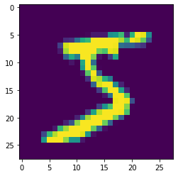

# Assignment II

> Simon Han YANG 1930026144

## Q1

a) Result:

    (13, 15, 16, 17, 19, 20, 20, 21, 22, 23, 25, 25, 26, 30, 31, 32, 35, 35, 35, 36)

    (48, 50, 52, 55)

    (70)

b) Result:

    Use boxplot to calculute

c) Result:

    Random Walk, Exponential Smoothing

## Q2

a) 0 + (72000 - 12800) / (100000 - 12800) * (1.0 - 0) = 0.206

b) (72000 - 54000) / 16000 = 1.125

c) 72000 / 100000 = 0.72

## Q3

```python
print("Author: Simon Han YANG")
print("Student ID: 1930026144")
```

    Author: Simon Han YANG
    Student ID: 1930026144

```python
import pandas as pd
import numpy as np
```

```python
# 1. load csv
df = pd.read_csv('mnist.csv')
```

```python
df
```

<div>
<style scoped>
    .dataframe tbody tr th:only-of-type {
        vertical-align: middle;
    }

    .dataframe tbody tr th {
        vertical-align: top;
    }
    
    .dataframe thead th {
        text-align: right;
    }

</style>

<table border="1" class="dataframe">
  <thead>
    <tr style="text-align: right;">
      <th></th>
      <th>label</th>
      <th>1x1</th>
      <th>1x2</th>
      <th>1x3</th>
      <th>1x4</th>
      <th>1x5</th>
      <th>1x6</th>
      <th>1x7</th>
      <th>1x8</th>
      <th>1x9</th>
      <th>...</th>
      <th>28x19</th>
      <th>28x20</th>
      <th>28x21</th>
      <th>28x22</th>
      <th>28x23</th>
      <th>28x24</th>
      <th>28x25</th>
      <th>28x26</th>
      <th>28x27</th>
      <th>28x28</th>
    </tr>
  </thead>
  <tbody>
    <tr>
      <th>0</th>
      <td>5</td>
      <td>0</td>
      <td>0</td>
      <td>0</td>
      <td>0</td>
      <td>0</td>
      <td>0</td>
      <td>0</td>
      <td>0</td>
      <td>0</td>
      <td>...</td>
      <td>0</td>
      <td>0</td>
      <td>0</td>
      <td>0</td>
      <td>0</td>
      <td>0</td>
      <td>0</td>
      <td>0</td>
      <td>0</td>
      <td>0</td>
    </tr>
    <tr>
      <th>1</th>
      <td>0</td>
      <td>0</td>
      <td>0</td>
      <td>0</td>
      <td>0</td>
      <td>0</td>
      <td>0</td>
      <td>0</td>
      <td>0</td>
      <td>0</td>
      <td>...</td>
      <td>0</td>
      <td>0</td>
      <td>0</td>
      <td>0</td>
      <td>0</td>
      <td>0</td>
      <td>0</td>
      <td>0</td>
      <td>0</td>
      <td>0</td>
    </tr>
    <tr>
      <th>2</th>
      <td>4</td>
      <td>0</td>
      <td>0</td>
      <td>0</td>
      <td>0</td>
      <td>0</td>
      <td>0</td>
      <td>0</td>
      <td>0</td>
      <td>0</td>
      <td>...</td>
      <td>0</td>
      <td>0</td>
      <td>0</td>
      <td>0</td>
      <td>0</td>
      <td>0</td>
      <td>0</td>
      <td>0</td>
      <td>0</td>
      <td>0</td>
    </tr>
    <tr>
      <th>3</th>
      <td>1</td>
      <td>0</td>
      <td>0</td>
      <td>0</td>
      <td>0</td>
      <td>0</td>
      <td>0</td>
      <td>0</td>
      <td>0</td>
      <td>0</td>
      <td>...</td>
      <td>0</td>
      <td>0</td>
      <td>0</td>
      <td>0</td>
      <td>0</td>
      <td>0</td>
      <td>0</td>
      <td>0</td>
      <td>0</td>
      <td>0</td>
    </tr>
    <tr>
      <th>4</th>
      <td>9</td>
      <td>0</td>
      <td>0</td>
      <td>0</td>
      <td>0</td>
      <td>0</td>
      <td>0</td>
      <td>0</td>
      <td>0</td>
      <td>0</td>
      <td>...</td>
      <td>0</td>
      <td>0</td>
      <td>0</td>
      <td>0</td>
      <td>0</td>
      <td>0</td>
      <td>0</td>
      <td>0</td>
      <td>0</td>
      <td>0</td>
    </tr>
    <tr>
      <th>...</th>
      <td>...</td>
      <td>...</td>
      <td>...</td>
      <td>...</td>
      <td>...</td>
      <td>...</td>
      <td>...</td>
      <td>...</td>
      <td>...</td>
      <td>...</td>
      <td>...</td>
      <td>...</td>
      <td>...</td>
      <td>...</td>
      <td>...</td>
      <td>...</td>
      <td>...</td>
      <td>...</td>
      <td>...</td>
      <td>...</td>
      <td>...</td>
    </tr>
    <tr>
      <th>59995</th>
      <td>8</td>
      <td>0</td>
      <td>0</td>
      <td>0</td>
      <td>0</td>
      <td>0</td>
      <td>0</td>
      <td>0</td>
      <td>0</td>
      <td>0</td>
      <td>...</td>
      <td>0</td>
      <td>0</td>
      <td>0</td>
      <td>0</td>
      <td>0</td>
      <td>0</td>
      <td>0</td>
      <td>0</td>
      <td>0</td>
      <td>0</td>
    </tr>
    <tr>
      <th>59996</th>
      <td>3</td>
      <td>0</td>
      <td>0</td>
      <td>0</td>
      <td>0</td>
      <td>0</td>
      <td>0</td>
      <td>0</td>
      <td>0</td>
      <td>0</td>
      <td>...</td>
      <td>0</td>
      <td>0</td>
      <td>0</td>
      <td>0</td>
      <td>0</td>
      <td>0</td>
      <td>0</td>
      <td>0</td>
      <td>0</td>
      <td>0</td>
    </tr>
    <tr>
      <th>59997</th>
      <td>5</td>
      <td>0</td>
      <td>0</td>
      <td>0</td>
      <td>0</td>
      <td>0</td>
      <td>0</td>
      <td>0</td>
      <td>0</td>
      <td>0</td>
      <td>...</td>
      <td>0</td>
      <td>0</td>
      <td>0</td>
      <td>0</td>
      <td>0</td>
      <td>0</td>
      <td>0</td>
      <td>0</td>
      <td>0</td>
      <td>0</td>
    </tr>
    <tr>
      <th>59998</th>
      <td>6</td>
      <td>0</td>
      <td>0</td>
      <td>0</td>
      <td>0</td>
      <td>0</td>
      <td>0</td>
      <td>0</td>
      <td>0</td>
      <td>0</td>
      <td>...</td>
      <td>0</td>
      <td>0</td>
      <td>0</td>
      <td>0</td>
      <td>0</td>
      <td>0</td>
      <td>0</td>
      <td>0</td>
      <td>0</td>
      <td>0</td>
    </tr>
    <tr>
      <th>59999</th>
      <td>8</td>
      <td>0</td>
      <td>0</td>
      <td>0</td>
      <td>0</td>
      <td>0</td>
      <td>0</td>
      <td>0</td>
      <td>0</td>
      <td>0</td>
      <td>...</td>
      <td>0</td>
      <td>0</td>
      <td>0</td>
      <td>0</td>
      <td>0</td>
      <td>0</td>
      <td>0</td>
      <td>0</td>
      <td>0</td>
      <td>0</td>
    </tr>
  </tbody>
</table>
<p>60000 rows × 785 columns</p>
</div>

```python
# 2. print the shape of the data
dfshape = df.shape
print(dfshape)
```

    (60000, 785)

```python
# extract first row data
firstrow = df.loc[0]

# 3.1 get first row pixel values
firstrowPixel = firstrow.drop(df.columns[[0]])
print(firstrowPixel)
```

    1x1      0
    1x2      0
    1x3      0
    1x4      0
    1x5      0
            ..
    28x24    0
    28x25    0
    28x26    0
    28x27    0
    28x28    0
    Name: 0, Length: 784, dtype: int64

```python
# 3.2 reshape the first row pixel values to (28, 28)
firstrowPixelReshape = firstrowPixel.values.reshape(28, 28)
print(firstrowPixelReshape.shape)
```

    (28, 28)

```python
# 4. plot the first sample
from matplotlib import pyplot as plt 

plt.imshow(firstrowPixelReshape)
```

    <matplotlib.image.AxesImage at 0x7fb1b2c13fd0>



```python
# split the data into X(pixel values) and y(digit label)
X = df.drop(columns=['label'])
y = df['label']
```

```python
# the pixel values
X
```

<div>
<style scoped>
    .dataframe tbody tr th:only-of-type {
        vertical-align: middle;
    }

    .dataframe tbody tr th {
        vertical-align: top;
    }
    
    .dataframe thead th {
        text-align: right;
    }

</style>

<table border="1" class="dataframe">
  <thead>
    <tr style="text-align: right;">
      <th></th>
      <th>1x1</th>
      <th>1x2</th>
      <th>1x3</th>
      <th>1x4</th>
      <th>1x5</th>
      <th>1x6</th>
      <th>1x7</th>
      <th>1x8</th>
      <th>1x9</th>
      <th>1x10</th>
      <th>...</th>
      <th>28x19</th>
      <th>28x20</th>
      <th>28x21</th>
      <th>28x22</th>
      <th>28x23</th>
      <th>28x24</th>
      <th>28x25</th>
      <th>28x26</th>
      <th>28x27</th>
      <th>28x28</th>
    </tr>
  </thead>
  <tbody>
    <tr>
      <th>0</th>
      <td>0</td>
      <td>0</td>
      <td>0</td>
      <td>0</td>
      <td>0</td>
      <td>0</td>
      <td>0</td>
      <td>0</td>
      <td>0</td>
      <td>0</td>
      <td>...</td>
      <td>0</td>
      <td>0</td>
      <td>0</td>
      <td>0</td>
      <td>0</td>
      <td>0</td>
      <td>0</td>
      <td>0</td>
      <td>0</td>
      <td>0</td>
    </tr>
    <tr>
      <th>1</th>
      <td>0</td>
      <td>0</td>
      <td>0</td>
      <td>0</td>
      <td>0</td>
      <td>0</td>
      <td>0</td>
      <td>0</td>
      <td>0</td>
      <td>0</td>
      <td>...</td>
      <td>0</td>
      <td>0</td>
      <td>0</td>
      <td>0</td>
      <td>0</td>
      <td>0</td>
      <td>0</td>
      <td>0</td>
      <td>0</td>
      <td>0</td>
    </tr>
    <tr>
      <th>2</th>
      <td>0</td>
      <td>0</td>
      <td>0</td>
      <td>0</td>
      <td>0</td>
      <td>0</td>
      <td>0</td>
      <td>0</td>
      <td>0</td>
      <td>0</td>
      <td>...</td>
      <td>0</td>
      <td>0</td>
      <td>0</td>
      <td>0</td>
      <td>0</td>
      <td>0</td>
      <td>0</td>
      <td>0</td>
      <td>0</td>
      <td>0</td>
    </tr>
    <tr>
      <th>3</th>
      <td>0</td>
      <td>0</td>
      <td>0</td>
      <td>0</td>
      <td>0</td>
      <td>0</td>
      <td>0</td>
      <td>0</td>
      <td>0</td>
      <td>0</td>
      <td>...</td>
      <td>0</td>
      <td>0</td>
      <td>0</td>
      <td>0</td>
      <td>0</td>
      <td>0</td>
      <td>0</td>
      <td>0</td>
      <td>0</td>
      <td>0</td>
    </tr>
    <tr>
      <th>4</th>
      <td>0</td>
      <td>0</td>
      <td>0</td>
      <td>0</td>
      <td>0</td>
      <td>0</td>
      <td>0</td>
      <td>0</td>
      <td>0</td>
      <td>0</td>
      <td>...</td>
      <td>0</td>
      <td>0</td>
      <td>0</td>
      <td>0</td>
      <td>0</td>
      <td>0</td>
      <td>0</td>
      <td>0</td>
      <td>0</td>
      <td>0</td>
    </tr>
    <tr>
      <th>...</th>
      <td>...</td>
      <td>...</td>
      <td>...</td>
      <td>...</td>
      <td>...</td>
      <td>...</td>
      <td>...</td>
      <td>...</td>
      <td>...</td>
      <td>...</td>
      <td>...</td>
      <td>...</td>
      <td>...</td>
      <td>...</td>
      <td>...</td>
      <td>...</td>
      <td>...</td>
      <td>...</td>
      <td>...</td>
      <td>...</td>
      <td>...</td>
    </tr>
    <tr>
      <th>59995</th>
      <td>0</td>
      <td>0</td>
      <td>0</td>
      <td>0</td>
      <td>0</td>
      <td>0</td>
      <td>0</td>
      <td>0</td>
      <td>0</td>
      <td>0</td>
      <td>...</td>
      <td>0</td>
      <td>0</td>
      <td>0</td>
      <td>0</td>
      <td>0</td>
      <td>0</td>
      <td>0</td>
      <td>0</td>
      <td>0</td>
      <td>0</td>
    </tr>
    <tr>
      <th>59996</th>
      <td>0</td>
      <td>0</td>
      <td>0</td>
      <td>0</td>
      <td>0</td>
      <td>0</td>
      <td>0</td>
      <td>0</td>
      <td>0</td>
      <td>0</td>
      <td>...</td>
      <td>0</td>
      <td>0</td>
      <td>0</td>
      <td>0</td>
      <td>0</td>
      <td>0</td>
      <td>0</td>
      <td>0</td>
      <td>0</td>
      <td>0</td>
    </tr>
    <tr>
      <th>59997</th>
      <td>0</td>
      <td>0</td>
      <td>0</td>
      <td>0</td>
      <td>0</td>
      <td>0</td>
      <td>0</td>
      <td>0</td>
      <td>0</td>
      <td>0</td>
      <td>...</td>
      <td>0</td>
      <td>0</td>
      <td>0</td>
      <td>0</td>
      <td>0</td>
      <td>0</td>
      <td>0</td>
      <td>0</td>
      <td>0</td>
      <td>0</td>
    </tr>
    <tr>
      <th>59998</th>
      <td>0</td>
      <td>0</td>
      <td>0</td>
      <td>0</td>
      <td>0</td>
      <td>0</td>
      <td>0</td>
      <td>0</td>
      <td>0</td>
      <td>0</td>
      <td>...</td>
      <td>0</td>
      <td>0</td>
      <td>0</td>
      <td>0</td>
      <td>0</td>
      <td>0</td>
      <td>0</td>
      <td>0</td>
      <td>0</td>
      <td>0</td>
    </tr>
    <tr>
      <th>59999</th>
      <td>0</td>
      <td>0</td>
      <td>0</td>
      <td>0</td>
      <td>0</td>
      <td>0</td>
      <td>0</td>
      <td>0</td>
      <td>0</td>
      <td>0</td>
      <td>...</td>
      <td>0</td>
      <td>0</td>
      <td>0</td>
      <td>0</td>
      <td>0</td>
      <td>0</td>
      <td>0</td>
      <td>0</td>
      <td>0</td>
      <td>0</td>
    </tr>
  </tbody>
</table>
<p>60000 rows × 784 columns</p>
</div>

```python
# the digit label
y
```

    0        5
    1        0
    2        4
    3        1
    4        9
            ..
    59995    8
    59996    3
    59997    5
    59998    6
    59999    8
    Name: label, Length: 60000, dtype: int64

```python
# Standardize X by dividing 255.0
X_stand = X / 255
```

```python
X_stand
```

<div>
<style scoped>
    .dataframe tbody tr th:only-of-type {
        vertical-align: middle;
    }

    .dataframe tbody tr th {
        vertical-align: top;
    }
    
    .dataframe thead th {
        text-align: right;
    }

</style>

<table border="1" class="dataframe">
  <thead>
    <tr style="text-align: right;">
      <th></th>
      <th>1x1</th>
      <th>1x2</th>
      <th>1x3</th>
      <th>1x4</th>
      <th>1x5</th>
      <th>1x6</th>
      <th>1x7</th>
      <th>1x8</th>
      <th>1x9</th>
      <th>1x10</th>
      <th>...</th>
      <th>28x19</th>
      <th>28x20</th>
      <th>28x21</th>
      <th>28x22</th>
      <th>28x23</th>
      <th>28x24</th>
      <th>28x25</th>
      <th>28x26</th>
      <th>28x27</th>
      <th>28x28</th>
    </tr>
  </thead>
  <tbody>
    <tr>
      <th>0</th>
      <td>0.0</td>
      <td>0.0</td>
      <td>0.0</td>
      <td>0.0</td>
      <td>0.0</td>
      <td>0.0</td>
      <td>0.0</td>
      <td>0.0</td>
      <td>0.0</td>
      <td>0.0</td>
      <td>...</td>
      <td>0.0</td>
      <td>0.0</td>
      <td>0.0</td>
      <td>0.0</td>
      <td>0.0</td>
      <td>0.0</td>
      <td>0.0</td>
      <td>0.0</td>
      <td>0.0</td>
      <td>0.0</td>
    </tr>
    <tr>
      <th>1</th>
      <td>0.0</td>
      <td>0.0</td>
      <td>0.0</td>
      <td>0.0</td>
      <td>0.0</td>
      <td>0.0</td>
      <td>0.0</td>
      <td>0.0</td>
      <td>0.0</td>
      <td>0.0</td>
      <td>...</td>
      <td>0.0</td>
      <td>0.0</td>
      <td>0.0</td>
      <td>0.0</td>
      <td>0.0</td>
      <td>0.0</td>
      <td>0.0</td>
      <td>0.0</td>
      <td>0.0</td>
      <td>0.0</td>
    </tr>
    <tr>
      <th>2</th>
      <td>0.0</td>
      <td>0.0</td>
      <td>0.0</td>
      <td>0.0</td>
      <td>0.0</td>
      <td>0.0</td>
      <td>0.0</td>
      <td>0.0</td>
      <td>0.0</td>
      <td>0.0</td>
      <td>...</td>
      <td>0.0</td>
      <td>0.0</td>
      <td>0.0</td>
      <td>0.0</td>
      <td>0.0</td>
      <td>0.0</td>
      <td>0.0</td>
      <td>0.0</td>
      <td>0.0</td>
      <td>0.0</td>
    </tr>
    <tr>
      <th>3</th>
      <td>0.0</td>
      <td>0.0</td>
      <td>0.0</td>
      <td>0.0</td>
      <td>0.0</td>
      <td>0.0</td>
      <td>0.0</td>
      <td>0.0</td>
      <td>0.0</td>
      <td>0.0</td>
      <td>...</td>
      <td>0.0</td>
      <td>0.0</td>
      <td>0.0</td>
      <td>0.0</td>
      <td>0.0</td>
      <td>0.0</td>
      <td>0.0</td>
      <td>0.0</td>
      <td>0.0</td>
      <td>0.0</td>
    </tr>
    <tr>
      <th>4</th>
      <td>0.0</td>
      <td>0.0</td>
      <td>0.0</td>
      <td>0.0</td>
      <td>0.0</td>
      <td>0.0</td>
      <td>0.0</td>
      <td>0.0</td>
      <td>0.0</td>
      <td>0.0</td>
      <td>...</td>
      <td>0.0</td>
      <td>0.0</td>
      <td>0.0</td>
      <td>0.0</td>
      <td>0.0</td>
      <td>0.0</td>
      <td>0.0</td>
      <td>0.0</td>
      <td>0.0</td>
      <td>0.0</td>
    </tr>
    <tr>
      <th>...</th>
      <td>...</td>
      <td>...</td>
      <td>...</td>
      <td>...</td>
      <td>...</td>
      <td>...</td>
      <td>...</td>
      <td>...</td>
      <td>...</td>
      <td>...</td>
      <td>...</td>
      <td>...</td>
      <td>...</td>
      <td>...</td>
      <td>...</td>
      <td>...</td>
      <td>...</td>
      <td>...</td>
      <td>...</td>
      <td>...</td>
      <td>...</td>
    </tr>
    <tr>
      <th>59995</th>
      <td>0.0</td>
      <td>0.0</td>
      <td>0.0</td>
      <td>0.0</td>
      <td>0.0</td>
      <td>0.0</td>
      <td>0.0</td>
      <td>0.0</td>
      <td>0.0</td>
      <td>0.0</td>
      <td>...</td>
      <td>0.0</td>
      <td>0.0</td>
      <td>0.0</td>
      <td>0.0</td>
      <td>0.0</td>
      <td>0.0</td>
      <td>0.0</td>
      <td>0.0</td>
      <td>0.0</td>
      <td>0.0</td>
    </tr>
    <tr>
      <th>59996</th>
      <td>0.0</td>
      <td>0.0</td>
      <td>0.0</td>
      <td>0.0</td>
      <td>0.0</td>
      <td>0.0</td>
      <td>0.0</td>
      <td>0.0</td>
      <td>0.0</td>
      <td>0.0</td>
      <td>...</td>
      <td>0.0</td>
      <td>0.0</td>
      <td>0.0</td>
      <td>0.0</td>
      <td>0.0</td>
      <td>0.0</td>
      <td>0.0</td>
      <td>0.0</td>
      <td>0.0</td>
      <td>0.0</td>
    </tr>
    <tr>
      <th>59997</th>
      <td>0.0</td>
      <td>0.0</td>
      <td>0.0</td>
      <td>0.0</td>
      <td>0.0</td>
      <td>0.0</td>
      <td>0.0</td>
      <td>0.0</td>
      <td>0.0</td>
      <td>0.0</td>
      <td>...</td>
      <td>0.0</td>
      <td>0.0</td>
      <td>0.0</td>
      <td>0.0</td>
      <td>0.0</td>
      <td>0.0</td>
      <td>0.0</td>
      <td>0.0</td>
      <td>0.0</td>
      <td>0.0</td>
    </tr>
    <tr>
      <th>59998</th>
      <td>0.0</td>
      <td>0.0</td>
      <td>0.0</td>
      <td>0.0</td>
      <td>0.0</td>
      <td>0.0</td>
      <td>0.0</td>
      <td>0.0</td>
      <td>0.0</td>
      <td>0.0</td>
      <td>...</td>
      <td>0.0</td>
      <td>0.0</td>
      <td>0.0</td>
      <td>0.0</td>
      <td>0.0</td>
      <td>0.0</td>
      <td>0.0</td>
      <td>0.0</td>
      <td>0.0</td>
      <td>0.0</td>
    </tr>
    <tr>
      <th>59999</th>
      <td>0.0</td>
      <td>0.0</td>
      <td>0.0</td>
      <td>0.0</td>
      <td>0.0</td>
      <td>0.0</td>
      <td>0.0</td>
      <td>0.0</td>
      <td>0.0</td>
      <td>0.0</td>
      <td>...</td>
      <td>0.0</td>
      <td>0.0</td>
      <td>0.0</td>
      <td>0.0</td>
      <td>0.0</td>
      <td>0.0</td>
      <td>0.0</td>
      <td>0.0</td>
      <td>0.0</td>
      <td>0.0</td>
    </tr>
  </tbody>
</table>
<p>60000 rows × 784 columns</p>
</div>

```python
# 7. Apply PCA to X
X_mean = np.mean(X_stand, axis=0)
X_new = X_stand - X_mean

eigvalue, eigvector = np.linalg.eig(np.cov(X_stand.T))
```

```python
eigvalue
```

    array([ 5.11687301e+00,  3.74139084e+00,  3.25270845e+00,  2.84162070e+00,
            2.56711774e+00,  2.27366339e+00,  1.72515498e+00,  1.52056024e+00,
            1.45630525e+00,  1.24275009e+00,  1.11208951e+00,  1.06664054e+00,
            9.04680833e-01,  8.92181223e-01,  8.32353048e-01,  7.81900323e-01,
            6.98386871e-01,  6.73255811e-01,  6.25995240e-01,  6.07763020e-01,
            5.62145880e-01,  5.30798829e-01,  5.02780255e-01,  4.81147033e-01,
            4.65783200e-01,  4.42538691e-01,  4.28439606e-01,  4.14618707e-01,
            3.92667337e-01,  3.64261791e-01,  3.46985958e-01,  3.41741890e-01,
            3.17734284e-01,  3.09280821e-01,  3.00549034e-01,  2.86632712e-01,
            2.66680512e-01,  2.57227909e-01,  2.53838022e-01,  2.49006738e-01,
            2.40823990e-01,  2.34543854e-01,  2.20658652e-01,  2.09962678e-01,
            2.02981381e-01,  1.97776690e-01,  1.90872477e-01,  1.85379715e-01,
            1.79298798e-01,  1.69711256e-01,  1.68204657e-01,  1.64929264e-01,
            1.56059568e-01,  1.52353954e-01,  1.49810350e-01,  1.42107650e-01,
            1.43117013e-01,  1.36282013e-01,  1.33802866e-01,  1.29062999e-01,
            1.26809057e-01,  1.26153552e-01,  1.21484982e-01,  1.16804842e-01,
            1.12686254e-01,  1.09261402e-01,  1.07056105e-01,  1.03755433e-01,
            1.01683293e-01,  9.94581989e-02,  9.85853673e-02,  9.54776582e-02,
            9.22166080e-02,  9.36212414e-02,  8.73975368e-02,  8.64145688e-02,
            8.51323757e-02,  8.17865524e-02,  7.78302901e-02,  7.54908896e-02,
            7.49204806e-02,  7.44243097e-02,  7.39082416e-02,  7.15682278e-02,
            7.05721295e-02,  6.86266001e-02,  6.98071773e-02,  6.63677373e-02,
            6.47622702e-02,  6.41065317e-02,  6.17074900e-02,  6.05681508e-02,
            5.97090309e-02,  5.84654674e-02,  5.74722004e-02,  5.63762527e-02,
            5.48385444e-02,  5.49382802e-02,  5.33882994e-02,  5.30039149e-02,
            5.18832114e-02,  5.00730745e-02,  4.96330571e-02,  4.72884093e-02,
            4.83057105e-02,  4.78672571e-02,  4.50897319e-02,  4.56285473e-02,
            4.45860845e-02,  4.33668340e-02,  4.17370035e-02,  4.13691058e-02,
            4.14393362e-02,  4.05373465e-02,  4.02834155e-02,  3.97072723e-02,
            3.88475534e-02,  3.83386957e-02,  3.79442909e-02,  3.72675348e-02,
            3.66668894e-02,  3.64948276e-02,  3.60277940e-02,  3.55404588e-02,
            3.51616897e-02,  3.40222260e-02,  3.35122826e-02,  3.33041276e-02,
            3.28447480e-02,  3.18247644e-02,  3.19144815e-02,  2.98096034e-02,
            3.13445527e-02,  3.10190633e-02,  3.09248062e-02,  3.04139593e-02,
            3.06517300e-02,  2.92504643e-02,  2.82173444e-02,  2.76860197e-02,
            2.77298958e-02,  2.69037633e-02,  2.65195948e-02,  2.62950898e-02,
            2.64197884e-02,  2.58921091e-02,  2.56004128e-02,  2.54585145e-02,
            2.49928121e-02,  2.46942504e-02,  2.46018566e-02,  2.44293863e-02,
            2.42166816e-02,  2.33422856e-02,  2.37466909e-02,  2.36637803e-02,
            2.30240536e-02,  2.25376133e-02,  2.24074179e-02,  2.22509896e-02,
            2.19083310e-02,  2.15984885e-02,  2.11338000e-02,  2.09787071e-02,
            2.05891304e-02,  2.07782672e-02,  2.03444301e-02,  1.99778048e-02,
            2.00240658e-02,  1.97162938e-02,  1.94777208e-02,  1.86988357e-02,
            1.89747180e-02,  1.92529039e-02,  1.91823872e-02,  1.86068681e-02,
            1.83111009e-02,  1.82409119e-02,  1.80031084e-02,  1.77735897e-02,
            1.78026781e-02,  1.74115219e-02,  1.71837629e-02,  1.73128101e-02,
            1.66706158e-02,  1.70275453e-02,  1.69392087e-02,  1.67298951e-02,
            1.63947300e-02,  1.61323563e-02,  1.59004870e-02,  1.59904392e-02,
            1.63206149e-02,  1.59448596e-02,  1.56441588e-02,  1.54735654e-02,
            1.55935082e-02,  1.54314255e-02,  1.51720020e-02,  1.49923614e-02,
            1.48669286e-02,  1.47142344e-02,  1.45383569e-02,  1.43664729e-02,
            1.42062206e-02,  1.41151143e-02,  1.39786991e-02,  1.39368901e-02,
            1.38080150e-02,  1.36797867e-02,  1.36326499e-02,  1.35464897e-02,
            1.33297432e-02,  1.34312405e-02,  1.33022120e-02,  1.31032668e-02,
            1.31584335e-02,  1.29745267e-02,  1.28627466e-02,  1.27524526e-02,
            1.25629939e-02,  1.26776258e-02,  1.27052659e-02,  1.24883116e-02,
            1.22628924e-02,  1.21337126e-02,  1.21959746e-02,  1.19995398e-02,
            1.20260823e-02,  1.17460796e-02,  1.16979301e-02,  1.16230242e-02,
            1.14872145e-02,  1.14234091e-02,  1.13447151e-02,  1.12936204e-02,
            1.12229814e-02,  1.10920816e-02,  1.10595255e-02,  1.09122317e-02,
            1.07942579e-02,  1.07703889e-02,  1.04922754e-02,  1.05971086e-02,
            1.06144780e-02,  1.04202563e-02,  9.31607507e-03,  9.36178930e-03,
            1.03251812e-02,  9.48361683e-03,  9.58982192e-03,  1.02144985e-02,
            9.96929513e-03,  1.01686355e-02,  9.82770405e-03,  1.01113887e-02,
            9.73415551e-03,  1.00992232e-02,  9.65654982e-03,  9.79898017e-03,
            9.91313454e-03,  9.68553118e-03,  9.27776490e-03,  9.16813326e-03,
            9.14418106e-03,  9.10288490e-03,  9.03646433e-03,  8.96532840e-03,
            8.92652439e-03,  8.85824192e-03,  8.80110198e-03,  8.77634932e-03,
            8.65789124e-03,  8.48313933e-03,  8.53582444e-03,  8.61972068e-03,
            8.57629462e-03,  8.42791280e-03,  8.37460824e-03,  8.29651753e-03,
            8.26414047e-03,  8.16709307e-03,  8.10971986e-03,  8.07064703e-03,
            8.01638541e-03,  7.90944942e-03,  7.89122034e-03,  7.81552191e-03,
            7.78624303e-03,  7.70469980e-03,  7.62692828e-03,  7.52519971e-03,
            7.55213340e-03,  7.47384551e-03,  7.49074316e-03,  7.40757855e-03,
            7.21508080e-03,  7.27471268e-03,  7.28870554e-03,  7.04509011e-03,
            7.09211939e-03,  7.15992706e-03,  7.16942654e-03,  6.97789533e-03,
            6.89137237e-03,  6.86436281e-03,  6.81022609e-03,  6.72337776e-03,
            6.66132284e-03,  6.63608750e-03,  6.75480283e-03,  6.70767779e-03,
            6.57654190e-03,  6.51493565e-03,  6.40974367e-03,  6.46534355e-03,
            6.38126294e-03,  6.32539400e-03,  6.27168280e-03,  6.29664221e-03,
            6.17209384e-03,  6.21491630e-03,  6.14230087e-03,  6.12142810e-03,
            6.02219383e-03,  5.92673807e-03,  6.03872818e-03,  5.86709381e-03,
            5.74579771e-03,  5.80295098e-03,  5.82256253e-03,  5.82832719e-03,
            5.71143276e-03,  5.64190327e-03,  5.67308162e-03,  5.53884795e-03,
            5.59975384e-03,  5.45294336e-03,  5.58520337e-03,  5.38046055e-03,
            5.31718516e-03,  5.39123697e-03,  3.60115997e-03,  5.28654834e-03,
            5.23952877e-03,  3.65100727e-03,  3.67244737e-03,  5.17372889e-03,
            5.10551314e-03,  5.14579304e-03,  5.25138298e-03,  5.03661228e-03,
            3.73329981e-03,  3.76549514e-03,  3.79978326e-03,  4.98496300e-03,
            4.94161714e-03,  4.94559693e-03,  4.87678089e-03,  3.83391293e-03,
            3.83926992e-03,  4.82903197e-03,  4.81897816e-03,  4.78087944e-03,
            3.87899940e-03,  3.89358534e-03,  3.93386168e-03,  4.74929407e-03,
            3.99683080e-03,  4.03829081e-03,  4.65366248e-03,  4.60444417e-03,
            4.71214007e-03,  4.70082952e-03,  4.08231563e-03,  4.11584479e-03,
            4.55075224e-03,  4.14563432e-03,  4.49002027e-03,  4.51204083e-03,
            4.31885947e-03,  4.26569251e-03,  4.19004011e-03,  4.19743823e-03,
            4.39274460e-03,  4.37508942e-03,  4.34981948e-03,  4.46072151e-03,
            4.27556387e-03,  3.09658791e-03,  3.13023433e-03,  3.15977361e-03,
            3.23139143e-03,  3.43997707e-03,  3.53572575e-03,  3.49227210e-03,
            3.58211391e-03,  3.38513516e-03,  3.27073398e-03,  3.35918884e-03,
            3.34564826e-03,  3.18037570e-03,  3.09082921e-03,  3.02574065e-03,
            2.99089844e-03,  2.97236094e-03,  2.93243032e-03,  2.87213882e-03,
            2.89472065e-03,  2.88615411e-03,  2.81188097e-03,  2.73394848e-03,
            2.75219979e-03,  2.12416081e-03,  2.65638636e-03,  2.62340036e-03,
            2.48909712e-03,  2.58712272e-03,  2.40438567e-03,  2.30483308e-03,
            2.18216927e-03,  2.56779547e-03,  2.46022774e-03,  2.52779472e-03,
            2.26334081e-03,  2.36789051e-03,  2.78158717e-03,  2.44872930e-03,
            2.77062491e-03,  2.20313834e-03,  2.23482022e-03,  2.22367525e-03,
            2.68980657e-03,  2.24659865e-03,  2.15365227e-03,  2.03462674e-03,
            1.92925025e-03,  2.01106624e-03,  2.01687153e-03,  1.99745997e-03,
            1.96793239e-03,  1.95477347e-03,  1.88573609e-03,  1.83855250e-03,
            1.86428040e-03,  1.82170999e-03,  1.81290521e-03,  1.76118050e-03,
            1.85875211e-03,  1.73991192e-03,  1.69769422e-03,  1.68403158e-03,
            1.66829063e-03,  1.63519187e-03,  1.57683290e-03,  1.59000395e-03,
            1.60335450e-03,  1.54027418e-03,  1.50366141e-03,  1.52201087e-03,
            1.47975652e-03,  9.17955755e-04,  9.27365633e-04,  1.45087593e-03,
            1.47144321e-03,  1.42071704e-03,  1.35888616e-03,  9.46816707e-04,
            9.58905544e-04,  9.54470305e-04,  9.72765864e-04,  9.99663562e-04,
            1.33354717e-03,  1.32674065e-03,  1.02892924e-03,  1.03472109e-03,
            1.04737356e-03,  1.30909269e-03,  1.13004213e-03,  1.12282232e-03,
            1.09966566e-03,  1.05924981e-03,  1.07440172e-03,  1.25096531e-03,
            1.30167435e-03,  1.23122085e-03,  1.22414188e-03,  1.11079643e-03,
            1.18730352e-03,  1.17922685e-03,  1.16621541e-03,  1.27855159e-03,
            1.28198436e-03,  1.28421681e-03,  7.47499366e-04,  7.56863207e-04,
            8.19313519e-04,  8.62509493e-04,  8.49328531e-04,  8.52741237e-04,
            7.68653387e-04,  8.38549736e-04,  7.89808588e-04,  8.01747244e-04,
            7.78153878e-04,  7.99696040e-04,  7.36166815e-04,  7.27075610e-04,
            7.21004328e-04,  7.03001713e-04,  6.90917423e-04,  6.61643349e-04,
            6.52818226e-04,  6.42480153e-04,  6.32792454e-04,  6.28100465e-04,
            6.20932904e-04,  6.18514223e-04,  5.39493151e-04,  5.28414744e-04,
            5.04843499e-04,  5.57316763e-04,  5.76664786e-04,  5.92974746e-04,
            5.99958239e-04,  4.94172729e-04,  4.53036511e-04,  5.80122634e-04,
            5.55646995e-04,  4.88260181e-04,  4.86251850e-04,  5.96691170e-04,
            4.64504712e-04,  4.67766069e-04,  4.30253233e-04,  4.20220935e-04,
            4.14804857e-04,  4.07778972e-04,  4.03030994e-04,  3.99532385e-04,
            3.97128673e-04,  3.62813202e-04,  3.76919827e-04,  3.83275680e-04,
            3.88516686e-04,  3.67058035e-04,  3.54073656e-04,  3.41142670e-04,
            3.44722646e-04,  3.23732019e-04,  3.50933982e-04,  3.12527051e-04,
            3.01973736e-04,  2.99337875e-04,  2.92891445e-04,  2.82050936e-04,
            2.77904052e-04,  2.73254830e-04,  2.43767106e-04,  2.63394110e-04,
            2.65697675e-04,  2.60080650e-04,  2.58403186e-04,  2.53645554e-04,
            2.40144693e-04,  2.47601673e-04,  2.20652586e-04,  2.21358395e-04,
            2.00345508e-04,  1.99349027e-04,  2.08010751e-04,  2.11574791e-04,
            2.10985677e-04,  9.49261716e-05,  9.72507939e-05,  9.76588542e-05,
            9.83371367e-05,  9.90798442e-05,  1.74637606e-04,  1.38587717e-04,
            1.34447703e-04,  1.07654234e-04,  1.24522991e-04,  1.10831956e-04,
            1.22085202e-04,  1.70720020e-04,  1.47831317e-04,  1.16402541e-04,
            1.69386624e-04,  1.67414945e-04,  1.19316821e-04,  1.18356373e-04,
            1.64482678e-04,  1.13421580e-04,  1.62509898e-04,  1.55854310e-04,
            1.56633050e-04,  1.59539031e-04,  1.58817925e-04,  1.13183474e-04,
            1.54201356e-04,  7.70356073e-05,  7.92719649e-05,  9.24986883e-05,
            8.46465576e-05,  8.53335594e-05,  7.32019528e-05,  6.95035268e-05,
            6.57407200e-05,  6.77341403e-05,  7.45176712e-05,  6.87144878e-05,
            5.90110143e-05,  5.68599474e-05,  5.52540880e-05,  5.49183956e-05,
            5.46107652e-05,  5.17359488e-05,  5.09545931e-05,  4.39283735e-05,
            4.92719825e-05,  4.61555739e-05,  4.79692584e-05,  4.74037076e-05,
            4.82835217e-05,  4.09222334e-05,  3.92789618e-05,  3.80596743e-05,
            3.51488807e-05,  3.47848603e-05,  3.35815014e-05,  2.02408309e-05,
            2.14317201e-05,  3.29832555e-05,  2.95774108e-05,  2.75359947e-05,
            2.51756402e-05,  2.48689969e-05,  2.27921158e-05,  3.11571006e-05,
            3.29736199e-05,  2.21679188e-05,  3.07332021e-05,  2.78506298e-05,
            2.98894331e-05,  2.45774628e-05,  1.88053259e-05,  1.90936362e-05,
            1.64671757e-05,  1.56506751e-05,  1.46796895e-05,  1.43773421e-05,
            1.35761302e-05,  1.34740830e-05,  1.24278011e-05,  1.21238430e-05,
            1.27221352e-05,  1.18819021e-05,  1.03431517e-05,  1.13358339e-05,
            9.02818979e-06,  1.06789062e-05,  9.31879666e-06,  1.06211054e-05,
            6.75175570e-06,  7.89403356e-06,  7.96126820e-06,  7.20242488e-06,
            7.13405847e-06,  5.64429445e-06,  4.98205264e-06,  4.63140134e-06,
            4.39022584e-06,  4.30670647e-06,  3.61113222e-06,  3.38556114e-06,
            3.54512583e-06,  3.14187782e-06,  2.92115220e-06,  2.42198513e-06,
            2.45764990e-06,  2.14342788e-06,  2.07520782e-06,  1.90053527e-06,
            1.88198911e-06,  1.70843392e-06,  1.62797221e-06,  1.58432450e-06,
            1.52415657e-06,  1.26674301e-06,  9.93705509e-07,  9.34608638e-07,
            8.76826740e-07,  8.54409983e-07,  5.87901568e-07,  4.55800354e-07,
            5.43435900e-07,  5.32448391e-07,  4.19593002e-07,  1.94992116e-07,
            2.61829607e-07,  2.86416147e-07,  3.63030501e-07,  3.64672029e-07,
            1.02292380e-07,  1.59250500e-07,  4.57336002e-08,  1.24548828e-08,
            1.33663582e-08,  3.73399225e-08,  3.65001077e-08,  8.07021507e-10,
            1.20151534e-18, -7.55747250e-18, -2.11007690e-19,  1.88671910e-20,
            3.68584127e-21,  0.00000000e+00,  0.00000000e+00,  0.00000000e+00,
            0.00000000e+00,  0.00000000e+00,  0.00000000e+00,  0.00000000e+00,
            0.00000000e+00,  0.00000000e+00,  0.00000000e+00,  0.00000000e+00,
            0.00000000e+00,  0.00000000e+00,  0.00000000e+00,  0.00000000e+00,
            0.00000000e+00,  0.00000000e+00,  0.00000000e+00,  0.00000000e+00,
            0.00000000e+00,  0.00000000e+00,  0.00000000e+00,  0.00000000e+00,
            0.00000000e+00,  0.00000000e+00,  0.00000000e+00,  0.00000000e+00,
            0.00000000e+00,  0.00000000e+00,  0.00000000e+00,  0.00000000e+00,
            0.00000000e+00,  0.00000000e+00,  0.00000000e+00,  0.00000000e+00,
            0.00000000e+00,  0.00000000e+00,  0.00000000e+00,  0.00000000e+00,
            0.00000000e+00,  0.00000000e+00,  0.00000000e+00,  0.00000000e+00,
            0.00000000e+00,  0.00000000e+00,  0.00000000e+00,  0.00000000e+00,
            0.00000000e+00,  0.00000000e+00,  0.00000000e+00,  0.00000000e+00,
            0.00000000e+00,  0.00000000e+00,  0.00000000e+00,  0.00000000e+00,
            0.00000000e+00,  0.00000000e+00,  0.00000000e+00,  0.00000000e+00,
            0.00000000e+00,  0.00000000e+00,  0.00000000e+00,  0.00000000e+00,
            0.00000000e+00,  0.00000000e+00,  0.00000000e+00,  0.00000000e+00])

```python
eigvector
```

    array([[0., 0., 0., ..., 0., 0., 0.],
           [0., 0., 0., ..., 0., 0., 0.],
           [0., 0., 0., ..., 0., 0., 0.],
           ...,
           [0., 0., 0., ..., 1., 0., 0.],
           [0., 0., 0., ..., 0., 1., 0.],
           [0., 0., 0., ..., 0., 0., 1.]])

```python
# 8. remove the imaginary part 
eigvalue_f = np.real(eigvalue)
eigvector_f = np.real(eigvector)
```

```python
eigvalue_f
```

    array([ 5.11687301e+00,  3.74139084e+00,  3.25270845e+00,  2.84162070e+00,
            2.56711774e+00,  2.27366339e+00,  1.72515498e+00,  1.52056024e+00,
            1.45630525e+00,  1.24275009e+00,  1.11208951e+00,  1.06664054e+00,
            9.04680833e-01,  8.92181223e-01,  8.32353048e-01,  7.81900323e-01,
            6.98386871e-01,  6.73255811e-01,  6.25995240e-01,  6.07763020e-01,
            5.62145880e-01,  5.30798829e-01,  5.02780255e-01,  4.81147033e-01,
            4.65783200e-01,  4.42538691e-01,  4.28439606e-01,  4.14618707e-01,
            3.92667337e-01,  3.64261791e-01,  3.46985958e-01,  3.41741890e-01,
            3.17734284e-01,  3.09280821e-01,  3.00549034e-01,  2.86632712e-01,
            2.66680512e-01,  2.57227909e-01,  2.53838022e-01,  2.49006738e-01,
            2.40823990e-01,  2.34543854e-01,  2.20658652e-01,  2.09962678e-01,
            2.02981381e-01,  1.97776690e-01,  1.90872477e-01,  1.85379715e-01,
            1.79298798e-01,  1.69711256e-01,  1.68204657e-01,  1.64929264e-01,
            1.56059568e-01,  1.52353954e-01,  1.49810350e-01,  1.42107650e-01,
            1.43117013e-01,  1.36282013e-01,  1.33802866e-01,  1.29062999e-01,
            1.26809057e-01,  1.26153552e-01,  1.21484982e-01,  1.16804842e-01,
            1.12686254e-01,  1.09261402e-01,  1.07056105e-01,  1.03755433e-01,
            1.01683293e-01,  9.94581989e-02,  9.85853673e-02,  9.54776582e-02,
            9.22166080e-02,  9.36212414e-02,  8.73975368e-02,  8.64145688e-02,
            8.51323757e-02,  8.17865524e-02,  7.78302901e-02,  7.54908896e-02,
            7.49204806e-02,  7.44243097e-02,  7.39082416e-02,  7.15682278e-02,
            7.05721295e-02,  6.86266001e-02,  6.98071773e-02,  6.63677373e-02,
            6.47622702e-02,  6.41065317e-02,  6.17074900e-02,  6.05681508e-02,
            5.97090309e-02,  5.84654674e-02,  5.74722004e-02,  5.63762527e-02,
            5.48385444e-02,  5.49382802e-02,  5.33882994e-02,  5.30039149e-02,
            5.18832114e-02,  5.00730745e-02,  4.96330571e-02,  4.72884093e-02,
            4.83057105e-02,  4.78672571e-02,  4.50897319e-02,  4.56285473e-02,
            4.45860845e-02,  4.33668340e-02,  4.17370035e-02,  4.13691058e-02,
            4.14393362e-02,  4.05373465e-02,  4.02834155e-02,  3.97072723e-02,
            3.88475534e-02,  3.83386957e-02,  3.79442909e-02,  3.72675348e-02,
            3.66668894e-02,  3.64948276e-02,  3.60277940e-02,  3.55404588e-02,
            3.51616897e-02,  3.40222260e-02,  3.35122826e-02,  3.33041276e-02,
            3.28447480e-02,  3.18247644e-02,  3.19144815e-02,  2.98096034e-02,
            3.13445527e-02,  3.10190633e-02,  3.09248062e-02,  3.04139593e-02,
            3.06517300e-02,  2.92504643e-02,  2.82173444e-02,  2.76860197e-02,
            2.77298958e-02,  2.69037633e-02,  2.65195948e-02,  2.62950898e-02,
            2.64197884e-02,  2.58921091e-02,  2.56004128e-02,  2.54585145e-02,
            2.49928121e-02,  2.46942504e-02,  2.46018566e-02,  2.44293863e-02,
            2.42166816e-02,  2.33422856e-02,  2.37466909e-02,  2.36637803e-02,
            2.30240536e-02,  2.25376133e-02,  2.24074179e-02,  2.22509896e-02,
            2.19083310e-02,  2.15984885e-02,  2.11338000e-02,  2.09787071e-02,
            2.05891304e-02,  2.07782672e-02,  2.03444301e-02,  1.99778048e-02,
            2.00240658e-02,  1.97162938e-02,  1.94777208e-02,  1.86988357e-02,
            1.89747180e-02,  1.92529039e-02,  1.91823872e-02,  1.86068681e-02,
            1.83111009e-02,  1.82409119e-02,  1.80031084e-02,  1.77735897e-02,
            1.78026781e-02,  1.74115219e-02,  1.71837629e-02,  1.73128101e-02,
            1.66706158e-02,  1.70275453e-02,  1.69392087e-02,  1.67298951e-02,
            1.63947300e-02,  1.61323563e-02,  1.59004870e-02,  1.59904392e-02,
            1.63206149e-02,  1.59448596e-02,  1.56441588e-02,  1.54735654e-02,
            1.55935082e-02,  1.54314255e-02,  1.51720020e-02,  1.49923614e-02,
            1.48669286e-02,  1.47142344e-02,  1.45383569e-02,  1.43664729e-02,
            1.42062206e-02,  1.41151143e-02,  1.39786991e-02,  1.39368901e-02,
            1.38080150e-02,  1.36797867e-02,  1.36326499e-02,  1.35464897e-02,
            1.33297432e-02,  1.34312405e-02,  1.33022120e-02,  1.31032668e-02,
            1.31584335e-02,  1.29745267e-02,  1.28627466e-02,  1.27524526e-02,
            1.25629939e-02,  1.26776258e-02,  1.27052659e-02,  1.24883116e-02,
            1.22628924e-02,  1.21337126e-02,  1.21959746e-02,  1.19995398e-02,
            1.20260823e-02,  1.17460796e-02,  1.16979301e-02,  1.16230242e-02,
            1.14872145e-02,  1.14234091e-02,  1.13447151e-02,  1.12936204e-02,
            1.12229814e-02,  1.10920816e-02,  1.10595255e-02,  1.09122317e-02,
            1.07942579e-02,  1.07703889e-02,  1.04922754e-02,  1.05971086e-02,
            1.06144780e-02,  1.04202563e-02,  9.31607507e-03,  9.36178930e-03,
            1.03251812e-02,  9.48361683e-03,  9.58982192e-03,  1.02144985e-02,
            9.96929513e-03,  1.01686355e-02,  9.82770405e-03,  1.01113887e-02,
            9.73415551e-03,  1.00992232e-02,  9.65654982e-03,  9.79898017e-03,
            9.91313454e-03,  9.68553118e-03,  9.27776490e-03,  9.16813326e-03,
            9.14418106e-03,  9.10288490e-03,  9.03646433e-03,  8.96532840e-03,
            8.92652439e-03,  8.85824192e-03,  8.80110198e-03,  8.77634932e-03,
            8.65789124e-03,  8.48313933e-03,  8.53582444e-03,  8.61972068e-03,
            8.57629462e-03,  8.42791280e-03,  8.37460824e-03,  8.29651753e-03,
            8.26414047e-03,  8.16709307e-03,  8.10971986e-03,  8.07064703e-03,
            8.01638541e-03,  7.90944942e-03,  7.89122034e-03,  7.81552191e-03,
            7.78624303e-03,  7.70469980e-03,  7.62692828e-03,  7.52519971e-03,
            7.55213340e-03,  7.47384551e-03,  7.49074316e-03,  7.40757855e-03,
            7.21508080e-03,  7.27471268e-03,  7.28870554e-03,  7.04509011e-03,
            7.09211939e-03,  7.15992706e-03,  7.16942654e-03,  6.97789533e-03,
            6.89137237e-03,  6.86436281e-03,  6.81022609e-03,  6.72337776e-03,
            6.66132284e-03,  6.63608750e-03,  6.75480283e-03,  6.70767779e-03,
            6.57654190e-03,  6.51493565e-03,  6.40974367e-03,  6.46534355e-03,
            6.38126294e-03,  6.32539400e-03,  6.27168280e-03,  6.29664221e-03,
            6.17209384e-03,  6.21491630e-03,  6.14230087e-03,  6.12142810e-03,
            6.02219383e-03,  5.92673807e-03,  6.03872818e-03,  5.86709381e-03,
            5.74579771e-03,  5.80295098e-03,  5.82256253e-03,  5.82832719e-03,
            5.71143276e-03,  5.64190327e-03,  5.67308162e-03,  5.53884795e-03,
            5.59975384e-03,  5.45294336e-03,  5.58520337e-03,  5.38046055e-03,
            5.31718516e-03,  5.39123697e-03,  3.60115997e-03,  5.28654834e-03,
            5.23952877e-03,  3.65100727e-03,  3.67244737e-03,  5.17372889e-03,
            5.10551314e-03,  5.14579304e-03,  5.25138298e-03,  5.03661228e-03,
            3.73329981e-03,  3.76549514e-03,  3.79978326e-03,  4.98496300e-03,
            4.94161714e-03,  4.94559693e-03,  4.87678089e-03,  3.83391293e-03,
            3.83926992e-03,  4.82903197e-03,  4.81897816e-03,  4.78087944e-03,
            3.87899940e-03,  3.89358534e-03,  3.93386168e-03,  4.74929407e-03,
            3.99683080e-03,  4.03829081e-03,  4.65366248e-03,  4.60444417e-03,
            4.71214007e-03,  4.70082952e-03,  4.08231563e-03,  4.11584479e-03,
            4.55075224e-03,  4.14563432e-03,  4.49002027e-03,  4.51204083e-03,
            4.31885947e-03,  4.26569251e-03,  4.19004011e-03,  4.19743823e-03,
            4.39274460e-03,  4.37508942e-03,  4.34981948e-03,  4.46072151e-03,
            4.27556387e-03,  3.09658791e-03,  3.13023433e-03,  3.15977361e-03,
            3.23139143e-03,  3.43997707e-03,  3.53572575e-03,  3.49227210e-03,
            3.58211391e-03,  3.38513516e-03,  3.27073398e-03,  3.35918884e-03,
            3.34564826e-03,  3.18037570e-03,  3.09082921e-03,  3.02574065e-03,
            2.99089844e-03,  2.97236094e-03,  2.93243032e-03,  2.87213882e-03,
            2.89472065e-03,  2.88615411e-03,  2.81188097e-03,  2.73394848e-03,
            2.75219979e-03,  2.12416081e-03,  2.65638636e-03,  2.62340036e-03,
            2.48909712e-03,  2.58712272e-03,  2.40438567e-03,  2.30483308e-03,
            2.18216927e-03,  2.56779547e-03,  2.46022774e-03,  2.52779472e-03,
            2.26334081e-03,  2.36789051e-03,  2.78158717e-03,  2.44872930e-03,
            2.77062491e-03,  2.20313834e-03,  2.23482022e-03,  2.22367525e-03,
            2.68980657e-03,  2.24659865e-03,  2.15365227e-03,  2.03462674e-03,
            1.92925025e-03,  2.01106624e-03,  2.01687153e-03,  1.99745997e-03,
            1.96793239e-03,  1.95477347e-03,  1.88573609e-03,  1.83855250e-03,
            1.86428040e-03,  1.82170999e-03,  1.81290521e-03,  1.76118050e-03,
            1.85875211e-03,  1.73991192e-03,  1.69769422e-03,  1.68403158e-03,
            1.66829063e-03,  1.63519187e-03,  1.57683290e-03,  1.59000395e-03,
            1.60335450e-03,  1.54027418e-03,  1.50366141e-03,  1.52201087e-03,
            1.47975652e-03,  9.17955755e-04,  9.27365633e-04,  1.45087593e-03,
            1.47144321e-03,  1.42071704e-03,  1.35888616e-03,  9.46816707e-04,
            9.58905544e-04,  9.54470305e-04,  9.72765864e-04,  9.99663562e-04,
            1.33354717e-03,  1.32674065e-03,  1.02892924e-03,  1.03472109e-03,
            1.04737356e-03,  1.30909269e-03,  1.13004213e-03,  1.12282232e-03,
            1.09966566e-03,  1.05924981e-03,  1.07440172e-03,  1.25096531e-03,
            1.30167435e-03,  1.23122085e-03,  1.22414188e-03,  1.11079643e-03,
            1.18730352e-03,  1.17922685e-03,  1.16621541e-03,  1.27855159e-03,
            1.28198436e-03,  1.28421681e-03,  7.47499366e-04,  7.56863207e-04,
            8.19313519e-04,  8.62509493e-04,  8.49328531e-04,  8.52741237e-04,
            7.68653387e-04,  8.38549736e-04,  7.89808588e-04,  8.01747244e-04,
            7.78153878e-04,  7.99696040e-04,  7.36166815e-04,  7.27075610e-04,
            7.21004328e-04,  7.03001713e-04,  6.90917423e-04,  6.61643349e-04,
            6.52818226e-04,  6.42480153e-04,  6.32792454e-04,  6.28100465e-04,
            6.20932904e-04,  6.18514223e-04,  5.39493151e-04,  5.28414744e-04,
            5.04843499e-04,  5.57316763e-04,  5.76664786e-04,  5.92974746e-04,
            5.99958239e-04,  4.94172729e-04,  4.53036511e-04,  5.80122634e-04,
            5.55646995e-04,  4.88260181e-04,  4.86251850e-04,  5.96691170e-04,
            4.64504712e-04,  4.67766069e-04,  4.30253233e-04,  4.20220935e-04,
            4.14804857e-04,  4.07778972e-04,  4.03030994e-04,  3.99532385e-04,
            3.97128673e-04,  3.62813202e-04,  3.76919827e-04,  3.83275680e-04,
            3.88516686e-04,  3.67058035e-04,  3.54073656e-04,  3.41142670e-04,
            3.44722646e-04,  3.23732019e-04,  3.50933982e-04,  3.12527051e-04,
            3.01973736e-04,  2.99337875e-04,  2.92891445e-04,  2.82050936e-04,
            2.77904052e-04,  2.73254830e-04,  2.43767106e-04,  2.63394110e-04,
            2.65697675e-04,  2.60080650e-04,  2.58403186e-04,  2.53645554e-04,
            2.40144693e-04,  2.47601673e-04,  2.20652586e-04,  2.21358395e-04,
            2.00345508e-04,  1.99349027e-04,  2.08010751e-04,  2.11574791e-04,
            2.10985677e-04,  9.49261716e-05,  9.72507939e-05,  9.76588542e-05,
            9.83371367e-05,  9.90798442e-05,  1.74637606e-04,  1.38587717e-04,
            1.34447703e-04,  1.07654234e-04,  1.24522991e-04,  1.10831956e-04,
            1.22085202e-04,  1.70720020e-04,  1.47831317e-04,  1.16402541e-04,
            1.69386624e-04,  1.67414945e-04,  1.19316821e-04,  1.18356373e-04,
            1.64482678e-04,  1.13421580e-04,  1.62509898e-04,  1.55854310e-04,
            1.56633050e-04,  1.59539031e-04,  1.58817925e-04,  1.13183474e-04,
            1.54201356e-04,  7.70356073e-05,  7.92719649e-05,  9.24986883e-05,
            8.46465576e-05,  8.53335594e-05,  7.32019528e-05,  6.95035268e-05,
            6.57407200e-05,  6.77341403e-05,  7.45176712e-05,  6.87144878e-05,
            5.90110143e-05,  5.68599474e-05,  5.52540880e-05,  5.49183956e-05,
            5.46107652e-05,  5.17359488e-05,  5.09545931e-05,  4.39283735e-05,
            4.92719825e-05,  4.61555739e-05,  4.79692584e-05,  4.74037076e-05,
            4.82835217e-05,  4.09222334e-05,  3.92789618e-05,  3.80596743e-05,
            3.51488807e-05,  3.47848603e-05,  3.35815014e-05,  2.02408309e-05,
            2.14317201e-05,  3.29832555e-05,  2.95774108e-05,  2.75359947e-05,
            2.51756402e-05,  2.48689969e-05,  2.27921158e-05,  3.11571006e-05,
            3.29736199e-05,  2.21679188e-05,  3.07332021e-05,  2.78506298e-05,
            2.98894331e-05,  2.45774628e-05,  1.88053259e-05,  1.90936362e-05,
            1.64671757e-05,  1.56506751e-05,  1.46796895e-05,  1.43773421e-05,
            1.35761302e-05,  1.34740830e-05,  1.24278011e-05,  1.21238430e-05,
            1.27221352e-05,  1.18819021e-05,  1.03431517e-05,  1.13358339e-05,
            9.02818979e-06,  1.06789062e-05,  9.31879666e-06,  1.06211054e-05,
            6.75175570e-06,  7.89403356e-06,  7.96126820e-06,  7.20242488e-06,
            7.13405847e-06,  5.64429445e-06,  4.98205264e-06,  4.63140134e-06,
            4.39022584e-06,  4.30670647e-06,  3.61113222e-06,  3.38556114e-06,
            3.54512583e-06,  3.14187782e-06,  2.92115220e-06,  2.42198513e-06,
            2.45764990e-06,  2.14342788e-06,  2.07520782e-06,  1.90053527e-06,
            1.88198911e-06,  1.70843392e-06,  1.62797221e-06,  1.58432450e-06,
            1.52415657e-06,  1.26674301e-06,  9.93705509e-07,  9.34608638e-07,
            8.76826740e-07,  8.54409983e-07,  5.87901568e-07,  4.55800354e-07,
            5.43435900e-07,  5.32448391e-07,  4.19593002e-07,  1.94992116e-07,
            2.61829607e-07,  2.86416147e-07,  3.63030501e-07,  3.64672029e-07,
            1.02292380e-07,  1.59250500e-07,  4.57336002e-08,  1.24548828e-08,
            1.33663582e-08,  3.73399225e-08,  3.65001077e-08,  8.07021507e-10,
            1.20151534e-18, -7.55747250e-18, -2.11007690e-19,  1.88671910e-20,
            3.68584127e-21,  0.00000000e+00,  0.00000000e+00,  0.00000000e+00,
            0.00000000e+00,  0.00000000e+00,  0.00000000e+00,  0.00000000e+00,
            0.00000000e+00,  0.00000000e+00,  0.00000000e+00,  0.00000000e+00,
            0.00000000e+00,  0.00000000e+00,  0.00000000e+00,  0.00000000e+00,
            0.00000000e+00,  0.00000000e+00,  0.00000000e+00,  0.00000000e+00,
            0.00000000e+00,  0.00000000e+00,  0.00000000e+00,  0.00000000e+00,
            0.00000000e+00,  0.00000000e+00,  0.00000000e+00,  0.00000000e+00,
            0.00000000e+00,  0.00000000e+00,  0.00000000e+00,  0.00000000e+00,
            0.00000000e+00,  0.00000000e+00,  0.00000000e+00,  0.00000000e+00,
            0.00000000e+00,  0.00000000e+00,  0.00000000e+00,  0.00000000e+00,
            0.00000000e+00,  0.00000000e+00,  0.00000000e+00,  0.00000000e+00,
            0.00000000e+00,  0.00000000e+00,  0.00000000e+00,  0.00000000e+00,
            0.00000000e+00,  0.00000000e+00,  0.00000000e+00,  0.00000000e+00,
            0.00000000e+00,  0.00000000e+00,  0.00000000e+00,  0.00000000e+00,
            0.00000000e+00,  0.00000000e+00,  0.00000000e+00,  0.00000000e+00,
            0.00000000e+00,  0.00000000e+00,  0.00000000e+00,  0.00000000e+00,
            0.00000000e+00,  0.00000000e+00,  0.00000000e+00,  0.00000000e+00])

```python
eigvector_f
```

    array([[0., 0., 0., ..., 0., 0., 0.],
           [0., 0., 0., ..., 0., 0., 0.],
           [0., 0., 0., ..., 0., 0., 0.],
           ...,
           [0., 0., 0., ..., 1., 0., 0.],
           [0., 0., 0., ..., 0., 1., 0.],
           [0., 0., 0., ..., 0., 0., 1.]])

```python
'''
    9. Use the top-30 eigenvectors (with the largest thirty eigenvalues) 
    to transform the training data to Z
''' 
Z = sorted(eigvalue_f, reverse=True)[:30]
```

```python
Z
```

    [5.11687300955891,
     3.74139083537875,
     3.2527084514920177,
     2.8416206976115173,
     2.5671177441085247,
     2.273663386010388,
     1.7251549821112324,
     1.5205602403242982,
     1.4563052526419076,
     1.2427500889188123,
     1.1120895080287407,
     1.0666405432780142,
     0.9046808327483584,
     0.8921812228637239,
     0.832353048039762,
     0.781900323368878,
     0.6983868713000024,
     0.6732558113274747,
     0.625995239575561,
     0.6077630200674494,
     0.5621458802208237,
     0.5307988293548577,
     0.5027802547225588,
     0.48114703293427064,
     0.46578320029933734,
     0.4425386905090258,
     0.4284396063785778,
     0.4146187072926854,
     0.39266733699323514,
     0.36426179130874825]

```python
# Reconstruct the training data from Z to X~, then multiply it by 255.0
eigval_index = np.argsort(eigvalue_f)           
neigval_index = eigval_index[-1: -(30 + 1): -1]  
neigvector = eigvector_f[:,neigval_index]  

X_recon = X_new.dot(neigvector) * 255
```

```python
X_recon
```

<div>
<style scoped>
    .dataframe tbody tr th:only-of-type {
        vertical-align: middle;
    }

    .dataframe tbody tr th {
        vertical-align: top;
    }
    
    .dataframe thead th {
        text-align: right;
    }

</style>

<table border="1" class="dataframe">
  <thead>
    <tr style="text-align: right;">
      <th></th>
      <th>0</th>
      <th>1</th>
      <th>2</th>
      <th>3</th>
      <th>4</th>
      <th>5</th>
      <th>6</th>
      <th>7</th>
      <th>8</th>
      <th>9</th>
      <th>...</th>
      <th>20</th>
      <th>21</th>
      <th>22</th>
      <th>23</th>
      <th>24</th>
      <th>25</th>
      <th>26</th>
      <th>27</th>
      <th>28</th>
      <th>29</th>
    </tr>
  </thead>
  <tbody>
    <tr>
      <th>0</th>
      <td>-123.932589</td>
      <td>-312.674262</td>
      <td>-24.514052</td>
      <td>-555.757958</td>
      <td>27.296668</td>
      <td>-232.476284</td>
      <td>233.995733</td>
      <td>-159.799494</td>
      <td>-363.515021</td>
      <td>-198.428077</td>
      <td>...</td>
      <td>-27.541857</td>
      <td>-64.353307</td>
      <td>217.178328</td>
      <td>-250.244425</td>
      <td>-46.166068</td>
      <td>-100.339444</td>
      <td>308.006769</td>
      <td>-170.105133</td>
      <td>-125.514290</td>
      <td>123.399691</td>
    </tr>
    <tr>
      <th>1</th>
      <td>-1011.718376</td>
      <td>-294.857038</td>
      <td>596.339561</td>
      <td>-460.766197</td>
      <td>827.275222</td>
      <td>-181.950528</td>
      <td>-45.020478</td>
      <td>104.969592</td>
      <td>40.459118</td>
      <td>-150.968899</td>
      <td>...</td>
      <td>-210.544690</td>
      <td>-84.828212</td>
      <td>1.529250</td>
      <td>-18.368722</td>
      <td>-232.015756</td>
      <td>-214.900420</td>
      <td>-12.287844</td>
      <td>-49.132144</td>
      <td>-361.427598</td>
      <td>85.728131</td>
    </tr>
    <tr>
      <th>2</th>
      <td>51.849608</td>
      <td>392.173153</td>
      <td>-188.509749</td>
      <td>521.011347</td>
      <td>306.680729</td>
      <td>-1.835346</td>
      <td>-859.047199</td>
      <td>-368.591875</td>
      <td>-114.546074</td>
      <td>178.508144</td>
      <td>...</td>
      <td>61.582234</td>
      <td>-3.992225</td>
      <td>-120.402950</td>
      <td>7.251599</td>
      <td>130.065424</td>
      <td>-86.447237</td>
      <td>-175.219060</td>
      <td>-140.722134</td>
      <td>13.122026</td>
      <td>278.232336</td>
    </tr>
    <tr>
      <th>3</th>
      <td>799.127037</td>
      <td>-607.197217</td>
      <td>273.651240</td>
      <td>105.878237</td>
      <td>1.853226</td>
      <td>699.654696</td>
      <td>-473.713204</td>
      <td>67.321708</td>
      <td>302.731266</td>
      <td>-11.111365</td>
      <td>...</td>
      <td>64.925543</td>
      <td>-124.194572</td>
      <td>-59.859978</td>
      <td>94.368643</td>
      <td>-129.342609</td>
      <td>-13.322722</td>
      <td>275.445361</td>
      <td>-140.888878</td>
      <td>9.421532</td>
      <td>119.027566</td>
    </tr>
    <tr>
      <th>4</th>
      <td>382.754942</td>
      <td>730.542867</td>
      <td>16.353747</td>
      <td>-241.697519</td>
      <td>-98.161346</td>
      <td>43.229727</td>
      <td>-91.666599</td>
      <td>405.554885</td>
      <td>225.501854</td>
      <td>-104.112265</td>
      <td>...</td>
      <td>6.817374</td>
      <td>-67.951070</td>
      <td>-233.402195</td>
      <td>-4.855432</td>
      <td>1.220624</td>
      <td>-82.297684</td>
      <td>187.344629</td>
      <td>-203.240189</td>
      <td>-127.122698</td>
      <td>-72.141997</td>
    </tr>
    <tr>
      <th>...</th>
      <td>...</td>
      <td>...</td>
      <td>...</td>
      <td>...</td>
      <td>...</td>
      <td>...</td>
      <td>...</td>
      <td>...</td>
      <td>...</td>
      <td>...</td>
      <td>...</td>
      <td>...</td>
      <td>...</td>
      <td>...</td>
      <td>...</td>
      <td>...</td>
      <td>...</td>
      <td>...</td>
      <td>...</td>
      <td>...</td>
      <td>...</td>
    </tr>
    <tr>
      <th>59995</th>
      <td>99.621760</td>
      <td>-293.475562</td>
      <td>135.940210</td>
      <td>-347.124204</td>
      <td>-304.275921</td>
      <td>236.993993</td>
      <td>-498.555370</td>
      <td>237.614980</td>
      <td>-494.897815</td>
      <td>-320.334732</td>
      <td>...</td>
      <td>84.345066</td>
      <td>99.503910</td>
      <td>348.158595</td>
      <td>-89.328428</td>
      <td>-10.865319</td>
      <td>30.998530</td>
      <td>-16.403939</td>
      <td>139.894785</td>
      <td>-177.994494</td>
      <td>173.030329</td>
    </tr>
    <tr>
      <th>59996</th>
      <td>-152.757810</td>
      <td>-687.899701</td>
      <td>-88.932413</td>
      <td>-650.013832</td>
      <td>-198.407548</td>
      <td>184.771874</td>
      <td>-487.139684</td>
      <td>-505.333589</td>
      <td>-668.867244</td>
      <td>-27.123424</td>
      <td>...</td>
      <td>83.703865</td>
      <td>-152.857724</td>
      <td>106.634852</td>
      <td>-25.276101</td>
      <td>34.629980</td>
      <td>90.536090</td>
      <td>-77.325287</td>
      <td>71.034165</td>
      <td>46.886273</td>
      <td>65.516769</td>
    </tr>
    <tr>
      <th>59997</th>
      <td>178.053450</td>
      <td>160.078211</td>
      <td>-257.613082</td>
      <td>-714.650442</td>
      <td>210.315152</td>
      <td>-462.462634</td>
      <td>-464.535103</td>
      <td>184.822530</td>
      <td>-87.524346</td>
      <td>-268.114988</td>
      <td>...</td>
      <td>26.588918</td>
      <td>-271.161381</td>
      <td>205.553953</td>
      <td>68.422603</td>
      <td>370.340230</td>
      <td>27.201121</td>
      <td>109.253380</td>
      <td>157.219253</td>
      <td>-176.113556</td>
      <td>376.124041</td>
    </tr>
    <tr>
      <th>59998</th>
      <td>-130.606072</td>
      <td>-5.591936</td>
      <td>513.858674</td>
      <td>342.703565</td>
      <td>521.165818</td>
      <td>-540.554227</td>
      <td>-107.376421</td>
      <td>-140.728774</td>
      <td>-16.495785</td>
      <td>93.841658</td>
      <td>...</td>
      <td>-147.782338</td>
      <td>-121.212570</td>
      <td>41.707539</td>
      <td>90.907787</td>
      <td>-147.125102</td>
      <td>-442.795386</td>
      <td>-10.736807</td>
      <td>277.416401</td>
      <td>-118.761352</td>
      <td>-47.450197</td>
    </tr>
    <tr>
      <th>59999</th>
      <td>173.435952</td>
      <td>-24.718802</td>
      <td>556.018894</td>
      <td>-120.861880</td>
      <td>198.000309</td>
      <td>233.026434</td>
      <td>-461.439868</td>
      <td>154.455402</td>
      <td>87.303640</td>
      <td>120.779780</td>
      <td>...</td>
      <td>-442.795223</td>
      <td>-169.244859</td>
      <td>121.664721</td>
      <td>134.521858</td>
      <td>71.203255</td>
      <td>189.464598</td>
      <td>-154.232192</td>
      <td>177.904381</td>
      <td>-50.323057</td>
      <td>-38.687786</td>
    </tr>
  </tbody>
</table>
<p>60000 rows × 30 columns</p>
</div>
